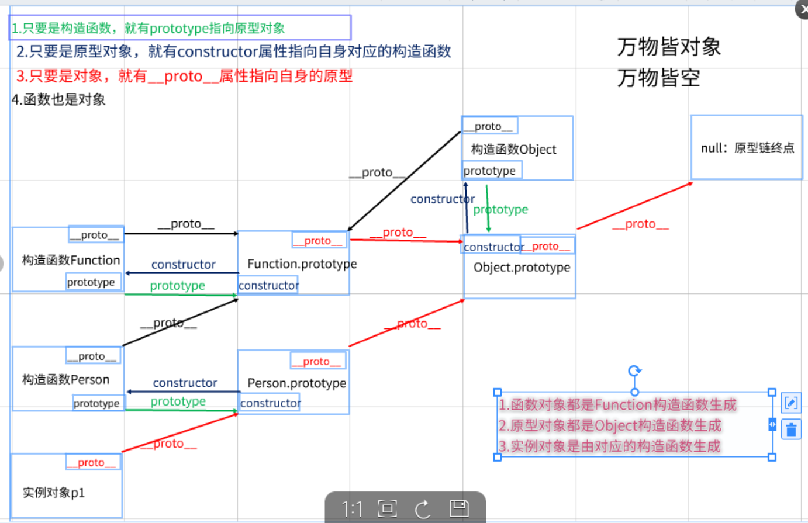

> ## 对原型链的理解

1. 原型
    - 原型指的就是一个对象，实例“继承”那个对象的属性。在原型上定义的属性，通过“继承”，实例也拥有了这个属性。“继承”这个行为是在 new 操作符内部实现的

2. 什么是原型链
   - 简单来说就是对象和构造函数之间连接的一个链条 简称原型链
2. 原型链的作用
   - 可以通过原型链继承构造函数对象定义的一些公共的属性方法
3. 
    - 实例w的隐式原型指向它构造函数的显式原型，指向的意思是恒等于
    ```javascript
        w.__proto__ === Word.prototype
     ```
4. 原型链的流程图

    