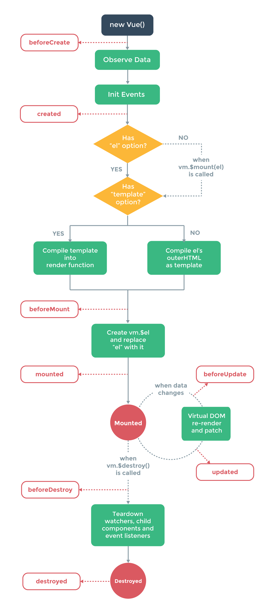

> ## vue 生命周期梳理
### 1. 首先是 Vue 实例化
- 具体做了什么：
  + 合并配置，初始化生命周期，初始化事件中心，初始化渲染，初始化 `data、props、computed、watcher` 等等，vue 把不同的功能逻辑拆成一些单独的函数执行。
  + 在初始化的最后，检测到如果有 `el` 属性，则调用 `vm.$mount` 方法挂载 `vm`，挂载的目标就是把模板渲染成最终的 `DOM`。

### 2. 生命周期钩子
- 生命周期钩子自动绑定this到实例上，因此你可以通过this.操作访问到数据和方法。注意不能使用箭头函数例如下方代码，因为箭头函数绑定外层的this会一直往上找。
- `beforeCreate`: 拿不到任何数据，它在实例初始化之后，数据观测 (data observer) 和 初始化 事件配置之前被调用。
    + 使用场景：可以在这加个loading事件
- `created`: 已经可以拿到data中的数据了，但是dom还没有挂载。会判断有无el，如果没有el，会调用vm.$mount(el)这个方法，如果也没有则停止后面的模板挂载。如果有的话，会判断是否含有“template”这个选项，如果有的话，它会把template解析成一个render function ，这是一个template编译的过程，结果是解析成了render函数，如果不是，就调用外部的html。
    + 使用场景:ajax请求和页面初始化、结束loading事件
- `beforeMount`: 和 created 拿到的数据相同,在挂载开始之前被调用：相关的 render 函数首次被调用。
- `mounted`: 中el被创建dom已经更新，vue实例对象中有template参数选项，则将其作为模板编译成render函数，编译优先级render函数选项 > template选项
    + 使用场景:常用于获取VNode信息和操作，ajax请求  
- 当数据发生改变后，会触发`beforeUpdate`和`updated`钩子，但是很少用，一般用计算属性和watch代替
- `beforeDestroyed`： 可以做一个确认停止事件的确认框 nextTick
- `destroyed`:  Vue 实例销毁后调用。调用后，Vue 实例指示的所有东西都会解绑定，所有的事件监听器会被移除，所有的子实例也会被销毁。

---
 vue生命周期图
    