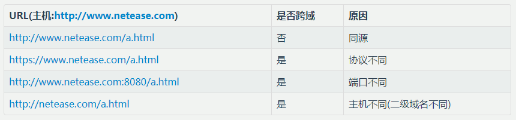

> ## 对跨域的裂解

Q：为什么会出现跨域问题？ 

A：出于浏览器的同源策略限制，浏览器会拒绝跨域请求。  
*注：严格的说，浏览器并不是拒绝所有的跨域请求，实际上拒绝的是跨域的读操作。浏览器的同源限制策略是这样执行的：
```
通常浏览器允许进行跨域写操作（Cross-origin writes），如链接，重定向；
通常浏览器允许跨域资源嵌入（Cross-origin embedding），如 img、script 标签；
通常浏览器不允许跨域读操作（Cross-origin reads）。
```

Q：什么情况才算作跨域？ 

A：非同源请求，均为跨域。
- 名词解释：
    - 同源 —— 如果两个页面拥有相同的协议（protocol），端口（port）和主机（host），那么这两个页面就属于同一个源（origin）。
---
 同源策略图
    

Q：为什么有跨域需求?

A：场景 —— 工程服务化后，不同职责的服务分散在不同的工程中，往往这些工程的域名是不同的，但一个需求可能需要对应到多个服务，这时便需要调用不同服务的接口，因此会出现跨域。

> ## 如何实现跨域
`通常，最常用的跨域方式有以下三种：JSONP、CORS、postMessage。`

### 1. JSONP
- 【实现原理】
    - 虽然因为同源策略的影响，不能通过XMLHttpRequest请求不同域上的数据（Cross-origin reads）。但是，在页面上引入不同域上的js脚本文件却是可以的（Cross-origin embedding）。因此在js文件载入完毕之后，触发回调，可以将需要的data作为参数传入。
```html
    <script type="text/javascript">
        function dosomething(data){
            //处理获得的数据
        }
    </script>
    <script src="http://example.com/data.php?callback=dosomething"></script>
```
```php
    <?php
    $callback = $_GET['callback'];//得到回调函数名
    $data = array('a','b','c');//要返回的数据
    echo $callback.'('.json_encode($data).')';//输出
    ?>
```
- 【JSONP的优缺点】
    + 优点：兼容性好（兼容低版本IE）
    + 缺点：1.JSONP只支持GET请求； 2.XMLHttpRequest相对于JSONP有着更好的错误处理机制

### 2. CORS
- CORS 是W3C 推荐的一种新的官方方案，能使服务器支持 XMLHttpRequest 的跨域请求。CORS 实现起来非常方便，只需要增加一些 HTTP 头，让服务器能声明允许的访问来源。

### 3.postMessage
- window.postMessage(message,targetOrigin) 方法是html5新引进的特性，可以使用它来向其它的window对象发送消息，无论这个window对象是属于同源或不同源，目前IE8+、FireFox、Chrome、Opera等浏览器都已经支持window.postMessage方法。

---
作者：网易考拉前端团队
链接：https://juejin.im/post/59c132415188256bb018e825
来源：掘金